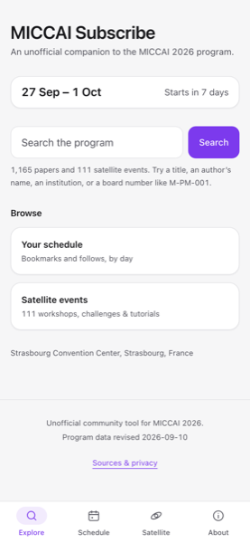
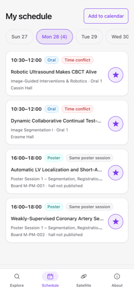
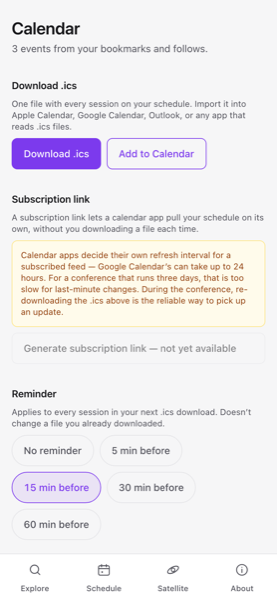
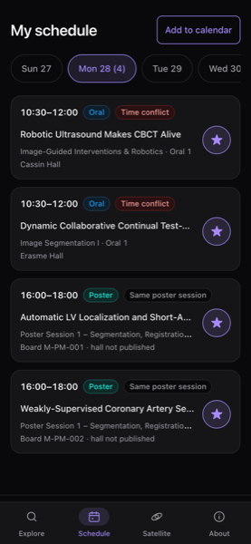

# MICCAI Subscribe

**Subscribe to the papers and people you care about at MICCAI 2026, and carry
the result in your pocket.**

English · [中文](README-CN.md)

<p align="center">
  
  
  
</p>

> **This is an independent, unofficial community tool.** It is not affiliated
> with, endorsed by, or produced by the MICCAI Society or the MICCAI 2026
> organizers, and it uses none of their branding. The official program is the
> authority — always confirm times and rooms on-site.

---

## The problem it solves

The MICCAI program is 1,100+ papers across three main-conference days, plus two
bookend days of workshops, challenges and tutorials — published as a pair of
PDFs. Finding the six talks you actually care about means scrolling a PDF on a
phone in a corridor, and then remembering them.

MICCAI Subscribe turns that program into something you can search, subscribe to,
and export. It runs entirely in your browser — no account, no sign-up, nothing
sent to a server.

## How to subscribe

"Subscribe" here means subscribing to **papers, people and institutions** — not
to a mailing list. There are two ways to do it, and they combine.

### Bookmark a single talk ★

Search for anything — a paper title, an author's name, an institution, or a
board number like `M-PM-001` — and tap the star on any presentation. It is now
on your schedule.

Every oral paper also gets a poster slot, so those show both, and you star
whichever one you plan to attend.

### Follow a person or a lab

On any author or institution page, tap **Follow**. From then on, *everything
they present* is gathered onto your schedule automatically — including papers
you have never seen, and papers added in a later revision of the program.

This is what makes it a subscription rather than a bookmark list. If your
advisor, a collaborator, or a lab you're watching has six papers across three
days, following them once collects all six.

A followed paper can be removed from your schedule individually, without
unfollowing the person, for when one paper isn't relevant to you.

### See your days


**My schedule** lays out what you've subscribed to one day at a time, with the
time leading each row because that's what you actually scan for.

It warns you about clashes, honestly:

- **Time conflict** (red) — two talks you cannot both attend.
- **Partial overlap** (amber) — a talk running into a poster session.
- **Same poster session** (neutral, and deliberately *not* called a conflict) —
  several posters in one two-hour session are several easy walks between
  boards, not a problem. Calling that a conflict would train you to ignore the
  badge that matters.

If a talk you saved is withdrawn or renumbered in a program revision, you get a
banner telling you. It is never silently dropped.

<br clear="right">

### Take it to your calendar



Download one `.ics` file with everything on your schedule and import it into
Apple Calendar, Google Calendar, Outlook, or anything else that reads `.ics`.
On a phone, **Add to Calendar** hands the file straight to the share sheet.

Pick a reminder offset — none, 5, 15, 30 or 60 minutes — before you export.

One thing this app deliberately will **not** do is invent per-talk times. The
official program publishes session windows only, so a calendar event is one
event per *session*, never one per talk. Splitting a 90-minute session into
twelve fabricated slots is how you miss the talk you came for.

<br clear="right">

### Move it to another device

Your subscriptions live in your browser's local storage, so they don't follow
you to a second device on their own. The **transfer link** on the calendar page
carries them: open it anywhere and import. The data rides in the part of the
URL after the `#`, which browsers never send to a server.

## What else is in it

- **Satellite events** — the workshops, challenges and tutorials on the two
  bookend days, as a chronological list or a room × time-slot grid, filterable
  by day, type and theme.
- **Works offline.** After your first visit, the app and the whole program are
  cached. That is the difference between usable and useless on venue Wi-Fi.
- **Installable.** Add it to your home screen and it opens like an app.
- **Dark mode**, following your system setting.
- **Built for a phone at 320px**, with 44px touch targets, visible keyboard
  focus, and a text label on everything — colour is never the only way
  something is distinguished.

<p align="center">
  
</p>

## About the data

Everything comes from the official MICCAI 2026 program PDFs and listing pages,
re-fetched daily. The app shows which revision it parsed, and when.

Three things worth knowing:

- **The official schedule is marked TENTATIVE** and does change — its
  *structure* changed once mid-flight, when a revision dropped an entire
  column. The importer refuses to publish data it cannot validate rather than
  quietly shipping a half-parsed program.
- **There are no per-talk times** in the source, and none are invented here.
- **An author is a name string.** The source has no ORCIDs, and several hundred
  names appear under more than one affiliation. The app says so plainly and
  shows paper counts and institutions rather than pretending to have resolved
  identity.

Where the source has nothing — no abstracts, no paper URLs, no poster hall name
— the app shows nothing. It never fills a gap with a placeholder.

## Privacy

No account, no analytics, no backend. Bookmarks, follows and preferences live in
your browser's local storage and nowhere else. The only ways data leaves your
device are ones you trigger yourself: sharing a transfer link, or using an "Add
to Google Calendar" link, which sends that one event to Google.

---

## Running it yourself

Requires Python 3.12+ and Node (see `.node-version`).

```bash
# Rebuild the program data (optional — data/processed is committed)
pip install -r requirements.txt
python3 scripts/fetch.py     # -> data/raw/<today>/ with a sha256 manifest
python3 scripts/build.py     # -> data/processed/, fails loudly if validation objects

# Run the app
cd web
npm ci
npm run dev
```

`web/public/data/program.min.json` is generated, not committed. `npm run dev`,
`npm run build` and `npm test` all regenerate it; running `vitest` directly does
not.

**How it fits together:** a Python importer parses the official PDFs into
`data/processed/program.min.json` (~130 KB gzipped); the frontend is a static
React + TypeScript SPA that downloads that one file and does everything else in
memory. There is no server component anywhere in this repository.

| path | what's there |
|---|---|
| `scripts/` | the importer — fetch, parse, validate, build. See `scripts/README.md`. |
| `config/` | hand-maintained parser inputs (satellite acronym aliases, program events). |
| `data/` | archived sources with checksums, and the built program JSON. |
| `web/src/` | the app: `routes/` pages, `ui/` components, `store/` state and schedule logic, `search/` the index, `calendar/` `.ics` generation. |
| `.github/workflows/` | the daily data refresh, which opens a PR and never auto-merges. |

Quality gates:

```bash
cd web
npm test                        # 252 tests across 24 files
npx tsc -b && npm run lint
npm run build                   # prints gzip sizes; budget is 150 KB
node scripts/verify-offline.mjs # real headless Chrome, network cut, 11 assertions
```

## Deploying

The build output is static, so anything that serves files will do. For
Cloudflare Pages: build command `cd web && npm ci && npm run build`, output
directory `web/dist`, Node version read from `.node-version`.

`web/public/_redirects` rewrites every path to `index.html` for client-side
routing, and `web/public/_headers` sets `no-cache` on app routes. After the
first deploy, check the headers survived the rewrite on a deep route, not just
at the root:

```bash
curl -sI https://<your-domain>/paper/M-PM-001 | grep -i cache-control
```

## Contributing

Issues and pull requests are welcome, especially parser fixes when the official
PDFs move. Please keep the tests green and run the typecheck and linter first.

A few decisions look arbitrary and are not: `program.min.json` has exactly one
cache writer, nothing inside a single session counts as a conflict, a bookmark
that stops resolving is reported rather than dropped, and type colours are three
functional groups rather than six hues because six failed a colour-blindness
simulation. Each is commented where it lives.
